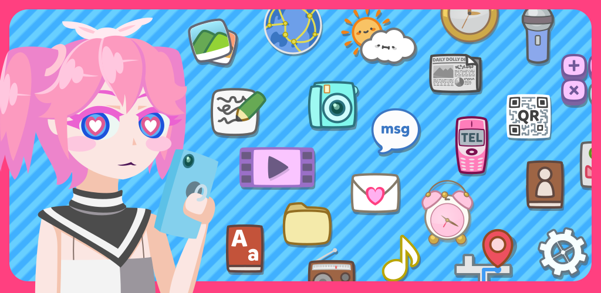

# Dollphone Icon Pack

[](/LICENSE)



## English
Dollphone is a cute icon pack that is very cute, but isn’t too hyper. The icons avoid overly saturated or dark colors, and softly bulge out the "straight" lines away from the center for a plushie-like look.

Dollphone Icon Pack is a crystallization of years of passion for the “yurukawa” aesthetic.

## 日本語
Dollphone は、かわいいけど元気すぎないアイコンパックです。極彩色や暗い色を避けて、外側に近づくにつれ少しずつ線を膨らませることによって、ぬいぐるみのようなふわっとした触感を演出しています。

Dollphone アイコンパックは、何年もまたいだ『ゆるかわ』への情熱の結晶です。

Dollphone is built with the [Candybar-FOSS Dashboard](https://github.com/Donnnno/candybar-foss).

# Design details

The icons are drafted in 128x128 resolution. Thick strokes are 4px wide and when it is necessary to use thinner strokes, they are 2px wide.

Drop shadows have the same color as the outline at 50% opacity, and moved 4px down, 2px right.

The fonts used are:
* **Most text:** [Mikado](https://www.hvdfonts.com/fonts/mikado) Bold by HVD Fonts
* **Japanese:** [ユールカ](https://fontworks.co.jp/fontsearch/yurukastd-ub/) (Yuruka) by Fontworks
* **Korean:** [CookieRun](https://www.cookierunfont.com) Black commissioned by Devsisters Corp.
* **Cyrillic and Greek:** [Tobi Greek Cyrillic](https://www.myfonts.com/collections/tobi-greek-cyrillic-font-rodrigotypo) by RodrigoTypo

# License
```
Copyright (c) 2024-2024 Haruki (Haley) Wakamatsu

Licensed under the Apache License, Version 2.0 (the "License");
you may not use this file except in compliance with the License.
You may obtain a copy of the License at

    http://www.apache.org/licenses/LICENSE-2.0

Unless required by applicable law or agreed to in writing, software
distributed under the License is distributed on an "AS IS" BASIS,
WITHOUT WARRANTIES OR CONDITIONS OF ANY KIND, either express or implied.
See the License for the specific language governing permissions and
limitations under the License.
```
