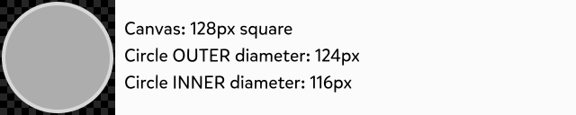
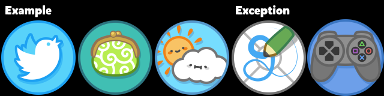
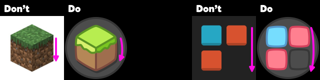
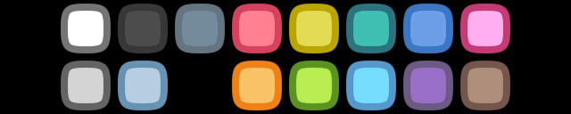
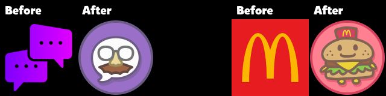
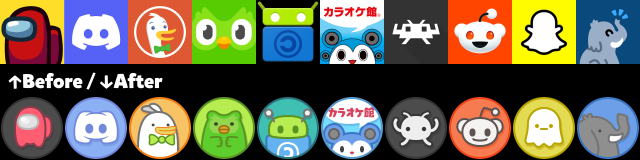
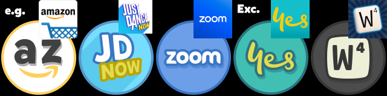

## Making the icon

Follow some of the specs and guidelines. Some requirements are more flexible than the others (From obligatory to non-obligatory: Required, Advised, Suggested)

### Shape and size

* {Required} The icons are drafted in 128x128px resolution.

* {Required} Thick strokes are 4px wide. When it is necessary to use thinner strokes, they are 2px wide.

    * {Advised} Put an outline on anything that appears in front of the background. This rule does not apply to colorations in the background. cf. [1.1.1.1](https://github.com/JapanYoshi/dollphone-foss/blob/main/app/src/main/res/drawable-nodpi/a__1111.png) for a counterexample.

* {Required} When exporting the icons, export at 512x512 (4x resolution / 384dpi on Inkscape).

* {Required} Design within the icon frame: a 120x120px circle with a 4px stroke (making the bounding box 124x124).
    * Exceptionally, a select few icons may have elements going over the outlines or jutting out of the circle. cf. [8vim](https://github.com/JapanYoshi/dollphone-foss/blob/main/app/src/main/res/drawable-nodpi/a__8vim.png), [PS1](https://github.com/JapanYoshi/dollphone-foss/blob/main/app/src/main/res/drawable-nodpi/psx.png)

* {Advised} For the icon frame, the outline color should correspond to the background color. For counterexamples, cf. [Amazon](https://github.com/JapanYoshi/dollphone-foss/blob/main/app/src/main/res/drawable-nodpi/amazon.png), [Browser](https://github.com/JapanYoshi/dollphone-foss/blob/main/app/src/main/res/drawable-nodpi/browser.png), [ReVanced Manager](https://github.com/JapanYoshi/dollphone-foss/blob/main/app/src/main/res/drawable-nodpi/revanced_manager.png).

* {Advised} Drop shadows have the same color as the outline color corresponding to the background color, at 50% opacity, and moved 4px down, 2px right.

* {Suggested} You may also clip the contents using the outline, with or without an interior drop shadow. cf. [Map](https://github.com/JapanYoshi/dollphone-foss/blob/main/app/src/main/res/drawable-nodpi/map.png), [Settings](https://github.com/JapanYoshi/dollphone-foss/blob/main/app/src/main/res/drawable-nodpi/settings.png), [Steam](https://github.com/JapanYoshi/dollphone-foss/blob/main/app/src/main/res/drawable-nodpi/steam.png), [Tusky](https://github.com/JapanYoshi/dollphone-foss/blob/main/app/src/main/res/drawable-nodpi/tusky.png), [Weather](https://github.com/JapanYoshi/dollphone-foss/blob/main/app/src/main/res/drawable-nodpi/weather.png).

* {Advised} **Avoid straight lines** unless they exactly go through the center. Straight lines should be very rarely used; edges that are straight in other icon packs should softly bulge out away from the center.

* {Suggested} There is no standard for how big the logo should be in the center of the icon. Just use however much feels like a good amount of breathing room, using the existing icons as reference.

### Colors

* {Required} **Don't use pure black!**

* {Required} **Don't use fully saturated colors!** Mostly stick to the colors in the "generic colors" icons and the system icons:

Color       |      BG | Outline |    Spot
:--------   | ------: | ------: | ------:
White       | #ffffff | #747474 | #ffffff
Gray        | #d4d4d4 | #646464 | #8f8f8f
Black       | #4c4c4c | #373737 | #404040
Pale Blue   | #b5cee1 | #6693b1 | #f7ffff
Dark Gray   | #748b9b | #657580 | #d8dddf

Color       |      BG | Outline |    Spot
:--------   | ------: | ------: | ------:
Red         | #ff8090 | #d5425d | #d5425d
Orange      | #f8c365 | #f08117 | #f08117
Yellow      | #e2db53 | #b9a400 | #e0d60d
Green       | #b7ed50 | #5b9323 | #52d348
Teal        | #40bfb3 | #2c737f | #47aebf
Aqua        | #76ddfe | #5598cc | #45a9f3
Blue        | #6d9fe9 | #3a76c3 | #3a76c3
Purple      | #9a6fc7 | #6b5a83 | #af5fcc
Pink        | #ffb0f0 | #c33a75 | #fea2e0
Brown       | #af8f7c | #74564d | #9e6545

* {Suggested} Avoid gradients:
    * Gloss should be represented using stripes or dots as highlights. cf. [Camera](https://github.com/JapanYoshi/dollphone-foss/blob/main/app/src/main/res/drawable-nodpi/camera.png), [Clock](https://github.com/JapanYoshi/dollphone-foss/blob/main/app/src/main/res/drawable-nodpi/clock.png), [Nintendo DS](https://github.com/JapanYoshi/dollphone-foss/blob/main/app/src/main/res/drawable-nodpi/nds.png)
    * For counterexamples, cf. [Firefox](https://github.com/JapanYoshi/dollphone-foss/blob/main/app/src/main/res/drawable-nodpi/firefox.png), [Instagram](https://github.com/JapanYoshi/dollphone-foss/blob/main/app/src/main/res/drawable-nodpi/instagram.png), [Opera](https://github.com/JapanYoshi/dollphone-foss/blob/main/app/src/main/res/drawable-nodpi/opera.png), [Steam](https://github.com/JapanYoshi/dollphone-foss/blob/main/app/src/main/res/drawable-nodpi/steam.png), [YouTube Vanced](https://github.com/JapanYoshi/dollphone-foss/blob/main/app/src/main/res/drawable-nodpi/youtube_vanced.png).

### Visual Style and Design Language

* {Advised} If the logo represents something tangible, skeuomorphize it using cute real-life objects. cf. [Phone/Dialer](https://github.com/JapanYoshi/dollphone-foss/blob/main/app/src/main/res/drawable-nodpi/phone.png) (that Nokia brick), [Alarm Clock](https://github.com/JapanYoshi/dollphone-foss/blob/main/app/src/main/res/drawable-nodpi/alarm_clock.png) (a cute round alarm clock I found online), [Radio](https://github.com/JapanYoshi/dollphone-foss/blob/main/app/src/main/res/drawable-nodpi/radio.png) (a classic brown radio).

* {Suggested} If the logo is too simple, replace it with an older version or a recognizable mascot. cf. [Fake Chat](https://github.com/JapanYoshi/dollphone-foss/blob/main/app/src/main/res/drawable-nodpi/fake_chat.png), [McDonald's](https://github.com/JapanYoshi/dollphone-foss/blob/main/app/src/main/res/drawable-nodpi/mcdonalds.png), or [the alternate Instagram icon](https://github.com/JapanYoshi/dollphone-foss/blob/main/app/src/main/res/drawable-nodpi/instagram_1.png).

* {Suggested} If the logo features a non-human mascot, recreate it in the style of Sumikko Gurashi, Pusheen, Tamagotchi, or another similar sytle. cf. [Among Us](https://github.com/JapanYoshi/dollphone-foss/blob/main/app/src/main/res/drawable-nodpi/among_us.png), [DuckDuckGo](https://github.com/JapanYoshi/dollphone-foss/blob/main/app/src/main/res/drawable-nodpi/duckduckgo.png), [Duolingo](https://github.com/JapanYoshi/dollphone-foss/blob/main/app/src/main/res/drawable-nodpi/duolingo.png), [Karaoke Kan](https://github.com/JapanYoshi/dollphone-foss/blob/main/app/src/main/res/drawable-nodpi/karaoke_kan.png), [Reddit](https://github.com/JapanYoshi/dollphone-foss/blob/main/app/src/main/res/drawable-nodpi/reddit.png), [RetroArch](https://github.com/JapanYoshi/dollphone-foss/blob/main/app/src/main/res/drawable-nodpi/retroarch.png), [Snapchat](https://github.com/JapanYoshi/dollphone-foss/blob/main/app/src/main/res/drawable-nodpi/snapchat.png), [TunnelBear](https://github.com/JapanYoshi/dollphone-foss/blob/main/app/src/main/res/drawable-nodpi/tunnelbear.png).

* {Suggested} If the logo features an anime-style human mascot, either recreate it in the style of the Dollphone mascot — cf. [Cosplay](https://github.com/JapanYoshi/dollphone-foss/blob/main/app/src/main/res/drawable-nodpi/cosplay.png), [Jackbox Games](https://github.com/JapanYoshi/dollphone-foss/blob/main/app/src/main/res/drawable-nodpi/jackbox.png), [Project Sekai](https://github.com/JapanYoshi/dollphone-foss/blob/main/app/src/main/res/drawable-nodpi/project_sekai.png) — or use the game's logo instead if it exists.

* {Suggested} Mock up text and details too small to read on an icon, using squiggles or dotted lines. cf. [Google Slides](https://github.com/JapanYoshi/dollphone-foss/blob/main/app/src/main/res/drawable-nodpi/google_slides.png), [Monospace](https://github.com/JapanYoshi/dollphone-foss/blob/main/app/src/main/res/drawable-nodpi/monospace.png), [SmartNews](https://github.com/JapanYoshi/dollphone-foss/blob/main/app/src/main/res/drawable-nodpi/smartnews.png).
    * For counterexamples, cf. [News](https://github.com/JapanYoshi/dollphone-foss/blob/main/app/src/main/res/drawable-nodpi/news.png), [PS1](https://github.com/JapanYoshi/dollphone-foss/blob/main/app/src/main/res/drawable-nodpi/psx.png).

### Fonts

* {Suggested} Use the following fonts for most, if not all, text:

    * **Latin:** [Mikado](https://www.hvdfonts.com/fonts/mikado) Bold by HVD Fonts (Sorry, this is a commercial font, so you'll have to look around if some GitHub repo accidentally left the font files in their files)
    * **Japanese:** [ユールカ](https://fontworks.co.jp/fontsearch/yurukastd-ub/) (Yuruka) by Fontworks (Sorry, this is also a paid font, so you'll have to do some research on the full archive of published Fontworks fonts)
    * **Korean:** [CookieRun](https://www.cookierunfont.com) Black commissioned by Devsisters Corp. (Free font)
    * **Cyrillic and Greek:** [Tobi Greek Cyrillic](https://www.myfonts.com/collections/tobi-greek-cyrillic-font-rodrigotypo) by RodrigoTypo (Once again, this is a commercial font)
    * \(The app’s body text uses [Bricolage Grotesque](https://ateliertriay.github.io/bricolage/) by Mathieu Triay. (It's a Google Font)\)

* {Suggested} When the icon consists of text, and the wordmark features some special styling, try to modify the above fonts to incorporate their special stylings. cf. [Amazon](https://github.com/JapanYoshi/dollphone-foss/blob/main/app/src/main/res/drawable-nodpi/amazon.png), [Tumblr](https://github.com/JapanYoshi/dollphone-foss/blob/main/app/src/main/res/drawable-nodpi/tumblr.png), [Zoom](https://github.com/JapanYoshi/dollphone-foss/blob/main/app/src/main/res/drawable-nodpi/zoom.png). For counterexamples, cf. [Optus](https://github.com/JapanYoshi/dollphone-foss/blob/main/app/src/main/res/drawable-nodpi/optus.png), [Pinterest](https://github.com/JapanYoshi/dollphone-foss/blob/main/app/src/main/res/drawable-nodpi/pinterest.png), [Wordfeud](https://github.com/JapanYoshi/dollphone-foss/blob/main/app/src/main/res/drawable-nodpi/wordfeud.png).

    * {Suggested} You may also simplify the logo by abbreviating it. cf. [Amazon](https://github.com/JapanYoshi/dollphone-foss/blob/main/app/src/main/res/drawable-nodpi/amazon.png) (abbreviated to "a→z"), [Just Dance Now](https://github.com/JapanYoshi/dollphone-foss/blob/main/app/src/main/res/drawable-nodpi/just_dance_now.png) (abbreviated to "JD NOW").

## Where/how do I submit the images?

1) Clone the repo locally on your computer in order to complete the following steps. This will also let you download the existing icon SVGs too, so you should do it anyway!

* Open the console (e.g. Powershell on Windows)

* Navigate to where you want the copy on your PC.
    * Use `dir` to show what files and folders exist where you are.
    * Use `cd` to navigate between folders:
        * `cd ..` exits the folder.
        * `cd myFolderName` enters the folder named "myFolderName" (Replace this command with what you want to enter)

* Finally, type this in: `git clone https://github.com/JapanYoshi/dollphone-foss.git --depth 1`.
    * If this causes an error, it may be because your computer doesn't have Git installed. Search the Internet for "how to install Git", then try this step again.

2) Save the SVG files to `/svg`.

* Consider optimizing the SVG files using vecta.io/nano.

3) Save the PNG exports to `/app/src/main/res/drawable-nodpi`.

* Make sure that the file name (sans `.png`) is a valid Java identifier: i.e. it only conatins lowercase alphanumerics, the underscore, and digits. (Also, digits cannot be the first letter of the filename.)

4) Edit `app/src/main/res/xml/appfilter.xml`, to tell the app which Activity to map to which drawable.

* This data can be exported from the Dollphone app using the Icon Request feature (send the email to yourself instead), or from [the IconRequest app](https://github.com/Kaiserdragon2/IconRequest/releases). **Make sure the value of `drawable="..."` is EXACTLY the same as the exported PNG file name (sans the `.png`)!**

5) Add your app to `app/src/main/res/xml/drawable.xml` TWICE: once to tell the app to show your new icons in the "Recent" section, and once again to tell the app which category to show the app under. Use the same `drawable` value here too.

* As of now, the categories are: System, Alternates, Google, Microsoft, Images & Editing, Music, Video, Browsers, SMS & Email, Social, Games, Non-App Games, Emulators, Files & Cloud, Keyboards, Shopping, Utilities, Dictionary, Other.

6) Give me a Pull Request. GitHub Desktop makes it really easy to do this.
